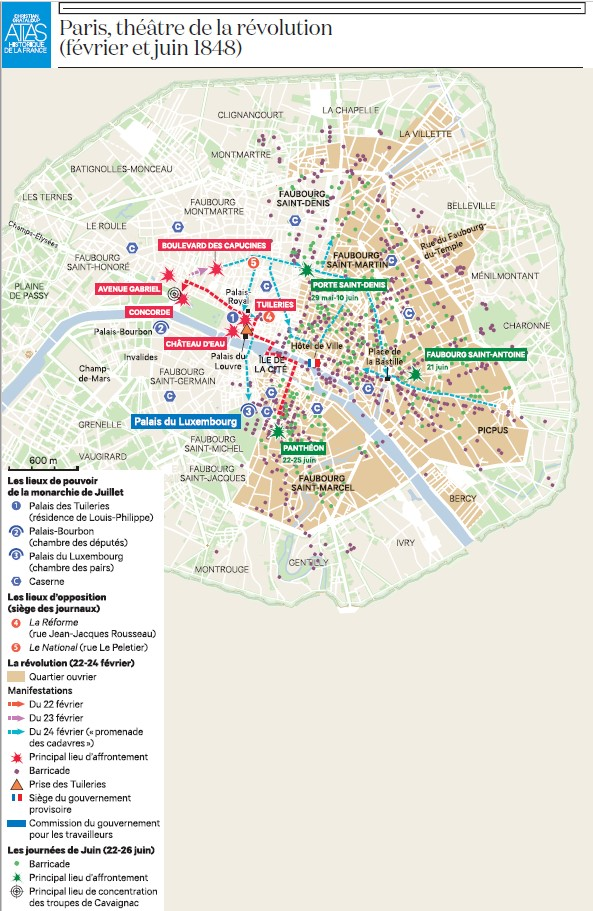
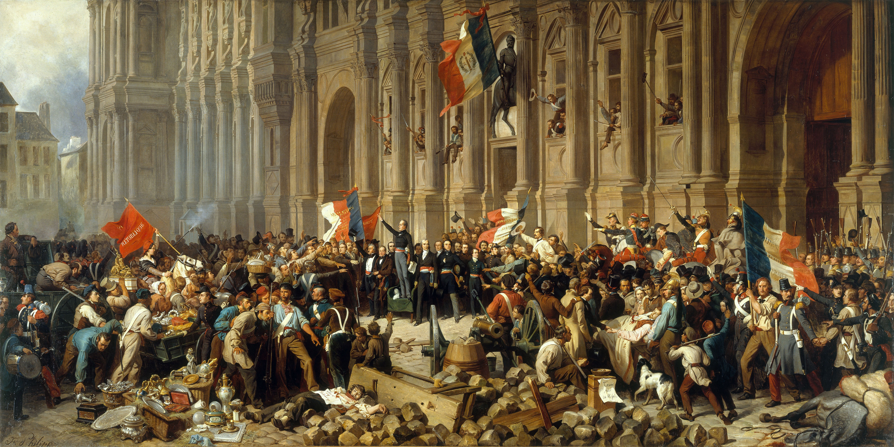
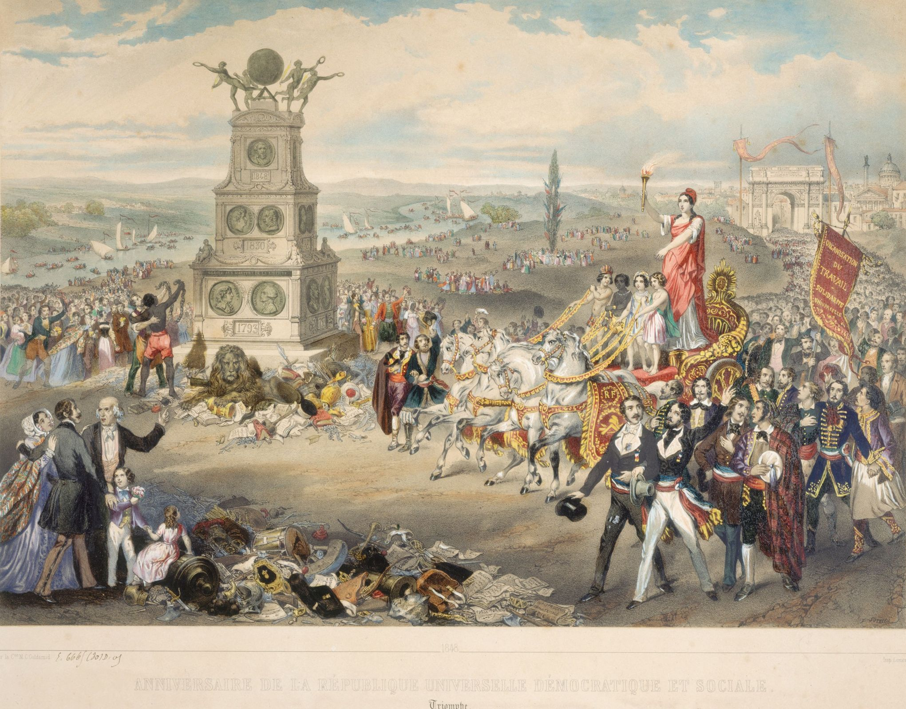
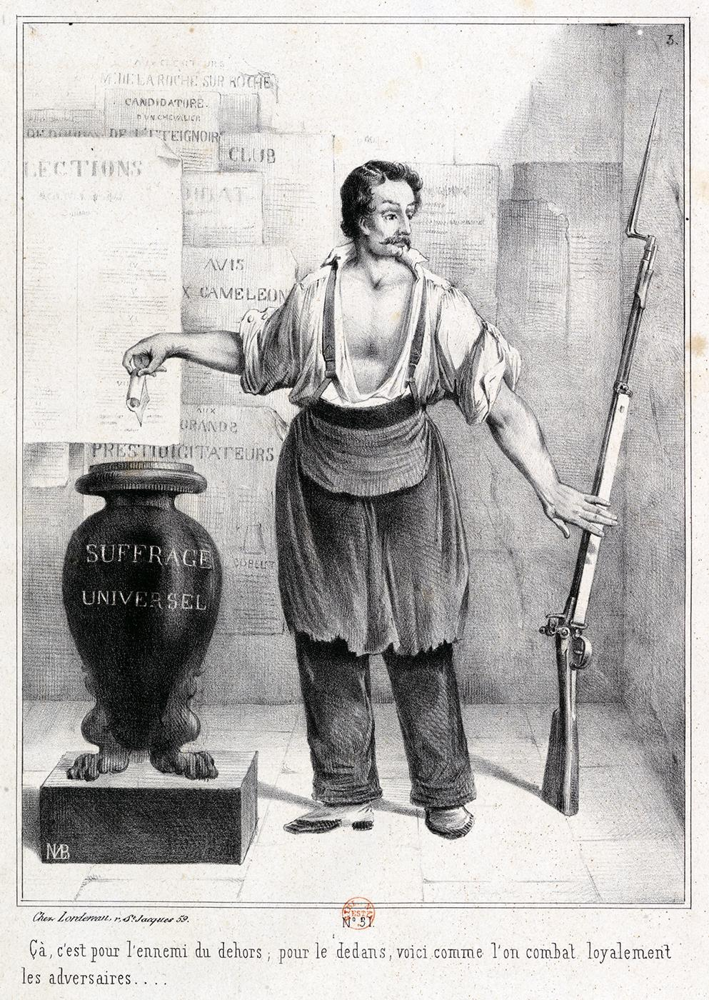
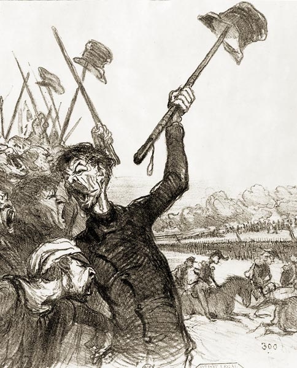
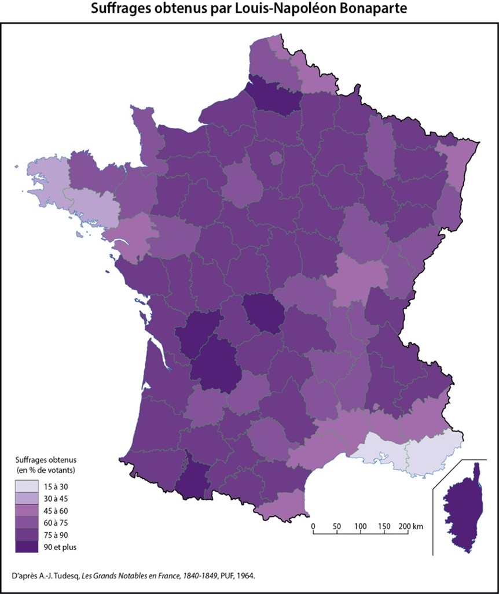

## La Révolution de Février: un carnaval républicain?

### Les barricades et les Cadavres

L'épisode révolutionnaire de Février 1848 est très proche de celui de 1830. Il s'agit pour beaucoup de renouer avec l'esprit des Trois Glorieuses. Jusqu'au dernier moment, le mouvement qui mène à la chute du roi Louis-Philippe est assez limité dans ses demandes et pacifique dans ses moyens. Cette nouvelle poussé révolutionnaire suit le rythme typique du siècle, où les régimes durent en général 15-20 ans; elle répond à la typique évolution vers la droite et à un contexte économique plus difficile. Le *roi citoyen*, sacré à la tête de l'État par La Fayette, porteur du souvenir de la Révolution de 1789 qui se souvenait aussi que « Philippe Égalité» (comme il s'était fait appeler après 1792) avait voté la mort du roi, s'était mué en un roi bourgeois. Or, le contrat fondamental de ce régime qui proposait l'enrichissement individuel des fortunes commerciales contre l'acceptation de l'ordre social ne tient pas dans un moment de crise. Alexis de Tocqueville sent bien venir l'orage. Dans un discours du 27 janvier, il avertit la Chambre des pairs:

>Messieurs, je ne sais si je me trompe, mais il me semble que l’état actuel des choses, l’état actuel de l’opinion, l’état des esprits en France, est de nature à alarmer et à affliger. Pour mon compte, je déclare sincèrement à la Chambre que j’éprouve une certaine crainte pour l’avenir […] pour la première fois peut-être depuis seize ans, le sentiment, l’instinct de l’instabilité, ce sentiment précurseur des révolutions, qui souvent les annonce, qui quelquefois les fait naître, que ce sentiment existe à un degré très grave dans le pays. […] Telle est, messieurs, ma conviction profonde ; je crois que nous nous endormons à l’heure qu’il est sur un volcan, j’en suis profondément convaincu.
>
>Songez, messieurs, à l’ancienne monarchie ; elle était plus forte que vous, plus forte par son origine ; elle s’appuyait mieux que vous sur d’anciens usages, sur de vieilles moeurs, sur d’antiques croyances ; elle était plus forte que vous, et cependant elle est tombée dans la poussière. Et pourquoi est-elle tombée ? Croyez-vous que ce soit par tel accident particulier ? Pensez-vous que ce soit le fait de tel homme, le déficit, le serment du Jeu de paume, Lafayette, Mirabeau ? Non, messieurs ; il y a une cause plus profonde et plus vraie, et cette cause c’est que la classe qui gouvernait alors était devenue, par son indifférence, par son égoïsme, par ses vices, incapable et indigne de gouverner. Voilà la véritable cause.
>
>[…] Est-ce que vous ne ressentez pas, par une sorte d’intuition instinctive qui ne peut pas s’analyser, mais qui est certaine, que le sol tremble de nouveau en Europe ? Est-ce que vous ne
sentez pas… que dirai-je ? Un vent de révolutions qui est dans l’air ? […] Est-ce donc que la vie des rois tient à des fils plus fermes et plus difficiles à briser que celle des autres hommes ? […] Est-ce que vous savez ce qui peut arriver en France d’ici à un an, à un mois, à un jour peut-être ? Vous l’ignorez ; mais ce que vous savez, c’est que la tempête est à l’horizon, c’est qu’elle marche sur vous ; vous laisserez-vous prévenir par elle ? [...]
>
>On a parlé de changements dans la législation. Je suis très porté à croire que ces changements sont non seulement utiles, mais nécessaires : ainsi je crois à l’utilité de la réforme électorale, à l’urgence de la réforme parlementaire […] mais, pour Dieu, changez l’esprit du gouvernement, car, je vous le répète, cet esprit-là vous conduit à l’abîme.

Le déclencheur des événements de Février est la **campagne des banquets**. Pour contourner l'interdiction des manifestations politiques, les partisans de la **réforme électorale**, c'est-à-dire de l'abaissement du *cens* et donc élargissement du corps électoral, déguisent des meetings politiques en «banquets», ou des «toasts» sont le prétexte des discours. Il ne s'agit que d'un ajustement dans le sens libéral de la Monarchie de juillet. Cependant, le ministre Guizot interdit les banquets et déclenche des manifestations, qui aboutissent au renvoi du ministre. Mais un coup de feu, très probablement accidentel, provoque des affrontements violents. Les corps des manifestants tués sont ramassés et promenés à travers Paris: cette ***Promenade des Cadavres*** mobilise la population. Le roi est contraint d'abdiquer et son trône est publiquement brûlé.

En apparence, c'est presque une répétition des Trois glorieuses de 1830. Les **modalités** de la révolte sont celles de tout le [xix]{.smallcaps}^e^ siècle: le moment de révolte voit apparaître des **barricades** de rue, faciles à construire dans les rues étroites des quartiers populaires de Paris. Cette forme d'action est très stable; elle est décrite par Victor Hugo dans le passage de [la mort de Gavroche](https://fr.wikisource.org/wiki/Les_Mis%C3%A9rables/Tome_5/Livre_1/15) dans *Les Misérables* (où toutefois il met en scène un épisode de 1832). Nous les rencontrons encore largement en 1870-1871 et jusqu'au Mai 1968. 

{width=500}

Les **acteurs** le sont aussi: Le mouvement initial correspond à l'intérêt de la *bourgeoisie libérale* dont seulement une partie peut voter. Cependant, dans la rue, ce sont les milieux populaires (autrement dit, le *prolétariat urbain*), qui obtient la victoire - voyez encore la scène des *Misérables*. Si les Parisiens montent aux barricades, des provinciaux de la **Garde Nationale** sont passifs et renoncent à défendre le régime. 

### Le Gouvernement provisoire: le carnaval républicain (24 février - 4 mai 1848)

#### Le gouvernement provisoire
Malgré une tentative de transmission de pouvoir monarchique, la République s'impose presque d'elle-même, et avec elle, le Gouvernement provisoire. Il est composé de 11 membres, les deux principaux sont le poète **Alphonse de Lamartine** et **Alexandre Ledru-Rollin** Ils sont tous des républicains sincères (au sens étymologique, d'attachement à la forme républicaine du pouvoir, par opposition à la monarchie) mais aux idées en fait très différentes, allant du socialisme (**Louis Blanc**, Alexandre Martin dit **Albert**, le seul ouvrier du gouvernement) à un conservatisme prudent (par exemple, Pierre Marie de Saint-Georges dit **Marie**). Lamartine lui-même, venu d'une famille noble de province, légitimiste à ses débuts, récuse aussi bien le socialisme que le «jacobinisme», associé au souvenir de la Terreur de l'An II (1792-1793).
Cette modération se manifeste dans l'épisode célèbre du **discours du drapeau**: le 25 février 1848, devant l'Hôtel de Ville, lieu traditionnel des révolutions parisiennes, Lamartine [prononce un discours](https://fr.wikisource.org/wiki/Discours_%C3%A0_l%E2%80%99H%C3%B4tel_de_Ville_du_25_f%C3%A9vrier_1848) assez conservateur à la défense du drapeau tricolore, utilisé déjà par la Monarchie de Juillet mais désormais décrit comme l'emblème de la Nation et non d'un régime, et contre l'adoption du drapeau rouge, désormais associé à la révolution et au socialisme. 

{width=600}

Ce Gouvernement se dit ouvertement provisoire (il ne doit fonctionner qu'en attendant que les nouvelles institutions soient élues), mais c'est lui qui réalise toutes les mesures proprement révolutionnaires.  
Ce succès initial de la république s'explique au moins en partie par un **changement de génération**: alors qu'en 1830, les acteurs de la révolution de 1789-1799 sont encore présents et actifs (bien qu'âgés, comme Louis-Philippe lui-même, La Fayette qui l'intronise, ou Talleyrand), tous les acteurs importants de 1848 sont nés pendant la période napoléonienne et n'ont pas connu la vie sous l'*Ancien régime*. 

#### L'esprit de 1848
La période qui va des journées de février 1848 à l'été de la même année est marquée par un enthousiasme utopique. Le grand mot du moment est la **fraternité**, qui rejoint à ce moment durablement la devise nationale (en 1789, on lui préférait souvent la *propriété*). On la célèbre à la fois au sens de la fraternité entre les différents peuples qui s'affirment comme nations et secoue le joug de l'ordre international de Vienne, et au sens de l'union nationale qui s'exprimerait dans cette révolution enfin pacifique. Les idéaux humanistes des libéraux et la charité chrétienne des conservateurs sont rapprochées. Ainsi, les **arbres de la liberté**, plantés un peu partout en France en souvenir de la révolution sont souvent bénis par les prêtres. Ce symbole remonte à 1789 et a été utilisé en 1830 mais change de sens: en 1830, l'arbre républicain s'opposait à la croix de mission catholique, alors que 18 ans plus tard, les prêtres s'associent à la célébration. Les images issues de cet esprit reprennent souvent, plus ou moins directement, des éléments de l'imaginaire religieux 

[{width=600}](https://histoire-image.org/etudes/utopisme-republicain-1848)

#### Les réformes
L'essentiel des réformes concrètes de cette période sont décidées sous le Gouvernement provisoire.  

* L'**abolition de l'esclavage** (27 avril) est une mesure emblématique; elle est commémorée encore de nos jours, mais on la célèbre immédiatement (notez sur l'illustration précédente deux personnages de Noirs libérés, déposant leurs chaînes au pied d'un monument imaginaire à la gloire des trois Révolutions françaises, lui-même inspiré dans sa forme d'un tombeau romain). Prise à l’initiative de **Victor Schœlcher**; elle s'inscrit dans une continuité -- la traite négrière avait été abolie par la Restauration -- mais signale aussi la prudence de 1848. Contrairement à l'abolition de 1793, cette fois-ci les propriétaires sont indemnisés (et, dans la pratique, les anciens esclaves deviennent souvent des ouvriers sous-payés dont la liberté n'est que formelle et dont la vie quotidienne ne change que peu).
* La **durée de travail** est pour la première fois limitée, à 11 heures en province et 10 heures à Paris. L'écart s'explique par une **très grand écart social** existant alors entre la capitale et la province, encore peu touchée par les débuts de l'industrialisation. 
* **La peine de mort** est abolie en matière politique dès le 27 février

Cependant, les mesures essentielles, qui définissent l'avenir de la république, concernent le **suffrage universel** (masculin), proclamé le 5 mars, et la question du **droit AU travail** (à ne surtout pas confondre avec le droit *du* travail). 

Le **suffrage universel** est la dernière grande réforme du Gouvernement provisoire. Cependant, l'idée est une évidence pour tout véritable républicain, **Ledru-Rollin l'avait réclamé dès 1842**. La réforme fait passer le corps électoral d’environ 2% de la population masculine de plus de 21 ans à plus de 90%. La force du suffrage universel est telle que son abolition pure et simple ne sera plus possible: en 1850, la restriction passera par l'obligation des 3 ans de résidence, ce qui a pour but d'exclure du vote les ouvriers trop mobiles. Il reste associé à une foi profonde dans son caractère **pacificateur**: le vote doit abolir pour toujours la violence politique. 

[{width=500}](https://histoire-image.org/etudes/vote-fusil)

Le suffrage est *universel* dans la mesure où il est libéré du *cens*, il reste cependant masculin. La possibilité de l'étendre aux femmes n'est envisagée que brièvement et écartée rapidement. Le 26 juillet, les femmes sont exclues de tous les débats publics. C'est un échec indéniable mais il faut retenir que la **question ne revient qu'en contexte révolutionnaire**: soulevée par Olympe de Gouges, la question avait été absente depuis la Révolution. Le bref moment de 1848 permet de poser les fondements du féminisme moderne et entamer des débats essentiels.  
La grande défenseuse du vote des femmes est **Eugénie Niboyet** qui crée le journal *La Voix des femmes*. **George Sand**, pourtant perçue comme figure subversive, estime que le vote n'est pas la question la plus urgente. Le coup d'éclat appartient à la socialiste **Jeanne Deroin** qui publie avec son amie **Désirée Gay** le journal *La Politique des femmes*, plus tard *L'Opinion des femmes* et qui se présente à l'élection législative de 1849.

Le **droit au travail** est envisagé comme une réponse à la **question sociale**, voire le *paupérisme*. La question apparaît aussi essentielle que celle du vote: le pionnier du socialisme, Proudhon, écrit *Quel est ton nom, Révolution de 1848? Je m'appelle Droit au Travail*. Il se traduit en un décret, rédigé par **Louis Blanc** contre l'opposition de Lamartine. 

>Le gouvernement provisoire de la République s'engage à garantir l'existence des ouvriers par le travail. Il s'engage à garantir le travail [...] à tous les citoyens. Il reconnaît que les ouvriers doivent s'associer entre eux pour jouir du bénéfice légitime de leur travail.

La traduction concrète de ce droit est la création des *Ateliers nationaux*. La tâche est confiée à un conservateur, **Marie**, qui s'efforce d'écarter le caractère socialiste de la mesure. Les Ateliers sont donc *nationaux* et non *sociaux*, dans la lignée des créations d'ateliers de bienfaisance déjà envisagées par les régimes antérieurs. Les chômeurs y sont employés à des travaux de terrassement, pénibles et peu utiles, ils sont payés le strict minimum. Les bénéficiaires sont insatisfaits, les conservateurs combattent le principe même de ces ateliers, et les paysans rejettent la hausse d'impôt (loi des «45 centimes») nécessaire à leur fonctionnement. Cependant, le travail des Ateliers devient la seule source de revenu de nombreux travailleurs touchés par le chômage.

## Une république s'abolit... (des élections de mai 1848 au coup d'État)

La phase d'euphorie révolutionnaire s'achève avec deux événements qu'il faut regarder de près; il est parfois possible d'en choisir un seul comme césure -- on préférera dans ce cas les journées de Juin.
Cette partie couvre deux étapes chronologiques que les spécialistes distinguent en général: d'une part, la Constituante, du 4 mai 1848 au 29 mai 1849, d'autre part, la période de la république constitutionnelle, du 29 mai 1849 au 2 décembre 1851. En pratique, on aura assez peu besoin de mobiliser cette césure ici.

### Les journées de Juin et leurs effets
Les journées de juin, et avant elles les élections de mai 1848 signifient la **déception** de la fraction la plus avancée des républicains, ceux qui ont fait la révolution de Février.  
Les élections de mai donnent la victoire à des républicains très modérés, représentants de la **bourgeoisie**, très hostiles à la révolution. Les résultats électoraux illustrent l'**écart entre Paris et le reste du pays**: tandis que dans la capitale, la fraction la plus avancée de la bourgeoisie s'allie avec le **prolétariat parisien**, déjà industriel, le reste du pays est hostile à ces initiatives qu'il ne comprend pas. 
Le déroulement de ces élections fait objet d'une description extrêmement connue par **Alexis de Tocqueville**. L'auteur est un noble normand, orléaniste, membre de l'«opposition dynastique» sous la Monarchie de Juillet; il est un grand théoricien de la démocratie. **Il faut connaître sa description**! Elle montre l'état d'esprit des votants ruraux, largement **analphabètes** (cf. la lettre de G. Sand à Eugène Sue), qui se déplacent au bureau de vote en une véritable procession et votent collectivement. Ce passage illustre comment le vote a été dominé par des **notables** bien établis et très peu révolutionnaires.

L'affrontement entre le prolétariat parisien et la bourgeoisie se déroule en deux temps. 
Le **15 mai** semble se répéter l'engrenage révolutionnaire. Une manifestation de rue est organisée pour soutenir le soulèvement qui a lieu alors en Pologne; de manière en apparence spontanée, les manifestants s'engouffrent dans l'Assemblée nationale (qui siège alors dans un bâtiment provisoire et étrangement peu défendu). Certains leaders socialistes croient voir la chance de relancer la révolution et instaurer un nouveau gouvernement provisoire: c'est le cas d'**Armand Barbès** (l'ami de George Sand) et, dans une moindre mesure, d'**Albert**. **Louis Blanc**, bien que réticent, est porté en triomphe. L'intervention de l'armée et de la **garde nationale** des «beaux quartiers» met fin à ce soulèvement, tellement maladroit qu'on a envisagé qu'il ait pu être une provocation volontaire des conservateurs. Les leaders socialistes (Barbès, Albert, Blanc, Blanqui) sont arrêtés, l'extrême gauche est décapitée.
Les autorités, désormais tenues exclusivement par des modérés, se méfient de plus en plus d'une agitation sociale des ouvriers. Cette méfiance se concentre sur les Ateliers nationaux. Ils avaient été conçus, déjà dans un esprit relativement conservateur, pour donner du travail aux ouvriers, mais aussi pour les encadrer, les écarter de Paris, et empêcher qu'ils entendent l'«agitation» des «clubs» (groupes politiques assez informels qui se sont multipliés après Février). Mais l'agitation est présente, et la décision est prise de supprimer les Ateliers. Le décret de suppression, publié le 22 juin, oblige les ouvriers de moins de 25 ans à s'engager dans l'armée.  
Cette décision provoque une **révolte spontanée**, suivie de trois jours de lutte (23, 24, 25 juin). Nous retrouvons la géographie familière des barricades érigées dans les quartiers Est de Paris. Du côté conservateur, les acteurs sont aussi familiers: outre les soldats de la troupe, les habitants des quartiers bourgeois de Paris, organisés en garde nationale, et les provinciaux, organisés en **garde nationale mobile**. Ils pensent défendre la légalité républicaine et l'**ordre** social.  
Mais l'Hôtel de Ville n'est pas pris, puis l'armée et la garde nationale reprennent l'initiative, sous les ordres du **général Cavaignac** qui dirige le gouvernement. La répression est dure: quelques exécutions sommaires le 26 juin et 15 000 déportations en Algérie.  

Les journées de Juin ont un effet profond. 

* L'élan révolutionnaire est définitivement brisé. 
* La rupture est définitive entre le prolétariat parisien et la république, désormais complètement bourgeoise.
* Les principales figures de Février, même non socialistes, considèrent que la répression est une trahison et se retirent (Lamartine, Ledru-Rollin. Pensez aussi au retrait de G. Sand).

Dans le cadre de la république, les forces conservatrices s'unissent autour de la défense de l'**ordre**. Le **Parti de l'Ordre** désigne au sens étroit l'alliance des **légitimistes** et des **orléanistes**. Les **légitimistes** sont des partisans de ligne aînée des Bourbons, celle de Louis XVIII et de Charles X. Leur prétendant est le **comte de Chambord**. Ils représentent les intérêts des fortunes **foncières**, proches de la tradition de la noblesse (mais la distinction entre la noblesse et la bourgeoisie s'est déjà effacé); ils sont en général catholiques et **cléricaux**. Les **orléanistes**, partisans de la Monarchie de juillet et du successeur de Louis-Philippe, le **comte de Paris**, représentent les intérêts des fortunes commerciales; c'est la bourgeoisie libérale économiquement et modérée politiquement.   
Dans le **Parti de l'Ordre** se réalise une union de la bourgeoisie contre, d'une part, le socialisme, d'autre part, le bonapartisme. Ce «parti» (entre guillemets parce que les partis au sens contemporain n'existent pas avant 1901) est au pouvoir à partir de 1849 mais la défense de l'ordre et de la propriété réunit les conservateurs et les républicains modérés, même s'ils ne donnent pas le même sens au mot: l'ordre est celui de la légalité pour les républicains, la soumission aux autorités traditionnelles pour les conservateurs.  
La seconde période (mai 1849-décembre 1851) est marquée par une peur de toute agitation sociale, des rumeurs de complots et de débauche morale. En plus d'une pratique répressive, le Parti de l'ordre s'efforce d'écarter ces dangers, réels comme imaginaires. Certaines mesures sont anecdotiques: par **peur du rouge**, on s'efforce d'exclure la couleur rouge de l'espace public, à coups de procès-verbaux. En 1850, la loi Grammont interdit les mauvais traitements infligés en public aux animaux, notamment pour empêcher les bouchers d'abattre les animaux sur la voie publique. Même si les progressistes (V. Schœlcher, V. Hugo) sont d'accord, la motivation n'est ni le bien-être animal, ni même l'hygiène -- il s'agit d'éviter que le peuple ne s'habitue à voir le sang.  
Le seul héritage juridique durable de cette époque est la **loi Falloux** de 1850. Portant le nom d'un ministre légitimiste, elle vise a renforcer l'enseignement catholique (dit «libre») et limiter la diffusion des idées progressistes. Cette loi est toujours en vigueur (bien qu'elle ait été remaniée plusieurs fois), et fonde l'enseignement privé.  
Enfin, le suffrage universel recule: une loi électorale (31 mai 1850) proposée par Faucher impose l'obligation de **trois ans** de résidence au lieu de vote; pour les ouvriers, il faut une attestation de l'employeur pour obtenir l'attestation de résidence. Sont ainsi écartés du vote tous ceux qui se déplacent à la recherche de l'emploi (les ouvriers qui ont encore des attaches rurales, les artisans...), ainsi que les ouvriers trop remuants à qui les employeurs peuvent refuser l'attestation: c'est un cens déguisé.

### Une constitution conservatrice
Une fois le pouvoir de l'Assemblée issue de l'élection de mai stabilisé, on met en chantier la constitution de la nouvelle république, la troisième constitution républicaine de l'histoire de France, après celle du 6 Messidor de l'An I (24 juin 1793), référence pour les révolutionnaires et les progressistes, et celle, thermidorienne, du 5 Fructidor An III (22 août 1795). Il n'est pas question de la commenter en détail, mais plusieurs questions centrales déterminent la suite des événements. 

La rédaction de la constitution est l'acte final des **républicains modérés** (bourgeois), qui par la suite cèdent le pouvoir aux royalistes réunis dans le Parti de l'Ordre et incapables de s'entendre sur le prétendant au trône. 
La **constitution** est dans ses termes assez proche de la Charte de 1830. Le **suffrage universel** (masculin) est vu comme inséparable de la République, mais légèrement limité par l'obligation de 6 mois de résidence dans sa commune d'habitation. Les **libertés** de 1848, liberté personnelle, celle de la presse, de la parole, d'association, de réunion, de culte etc, sont affirmées mais leurs conditions pratiques sont renvoyées à des «lois organiques» à établir plus tard. En pratique, ces lois seront formulées dans le sens conservateur et antidémocratique.  
Le droit au travail, que la gauche (qu'on appelle encore la Montagne) souhaiterait inscrire au moyen de l'**amendement Mathieu**, est écarté.  
À la tradition révolutionnaire française, on emprunte le **monocamérisme**: il n'y a qu'une Assemblée, composée de 750 membres, comme en 1791; à l'exemple américain, on prend l'institution d'un président de la république qui réunit tout le pouvoir exécutif (il est à la fois président et chef de gouvernement), élu par suffrage universel **direct**. En principe, la république se veut parlementaire; l'Assemblée peut écarter le président, elle ne peut être dissoute, elle décide en matière de guerre, de paix, des traités de commerce et d'amnistie. 
Le président, en revanche, dispose d'un très large contrôle sur toute l'administration, la fonction publique et l'armée. L'élection directe lui donne une **légitimité** forte et personnelle. 

Comme sécurité contre des tentations autoritaires, le président n'est pas rééligible (Art. 45), en outre, les républicains de plus en plus faibles face aux royalistes du Parti de l'Ordre, ont rendu très difficile toute révision de la constitution. 

Le danger de l'élection directe du président a été rapidement apparent, d'autant plus que la popularité croissante de Louis Bonaparte inquiète. **Jules Grévy** propose un amendement qui supprimerait la magistrature présidentielle. La foi en le suffrage universel et la confiance de certains leaders (Lamartine) dans leur popularité l'emporte et l'amendement est rejeté.

### Le «18 Brumaire de Louis Bonaparte», ou le coup d'État 
L'élection présidentielle est l'application immédiate de la Constitution, adoptée officiellement le 4 novembre 1848. Le candidat du pouvoir est le **général Cavaignac**, républicain authentique et sincère, mais dont le nom est entaché par la répression de Juin; Lamartine se lance, surestimant sa popularité. Cependant, la popularité personnelle de Louis-Napoléon Bonaparte est déjà croissante, et l'élection tourne au raz-de-marée bonapartiste.

Le candidat Bonaparte est un personnage ambigu et peu connu personnellement, mais il porte le nom le plus célèbre qui soit. Son principal atout est son nom: il se présente comme l'héritier de l'empire de son oncle. Mais pour les bourgeois dignes et graves qui dirigent le Parti de l'Ordre, Louis Bonaparte est suspect. Une rumeur (probablement fausse, mais on aime bien croire ce genre d'intrigues à l'époque) prétend se naissance illégitime. Tel un personnage de roman, Louis-Napoléon Bonaparte (LNB) a été collégien en Suisse, conspirateur raté et prisonnier politique en France, influencé par les idées proto-socialistes de Saint-Simon et auteur d'une brochure sur l'«extinction du *paupérisme*», exilé en Angleterre et même *carbonaro* (c'est-à-dire membre d'une société sécrète subversive, favorable à l'unité et indépendance italiennes). En somme, pour des messieurs conservateurs, il apparaît comme un aventurier. C'est aussi comme un aventurier médiocre, poussé au fond par les motifs égoïstes et bassement matériels, qu'il est dépeint par Karl Marx dans son *18 Brumaire de Louis Bonaparte*, un essai d'histoire immédiate où il fait la démonstration de sa méthode, mais aussi par le caricaturiste Honoré Daumier qui crée le personnage du militant bonapartiste brutal, le colonel Ratapoil.

LNB remporte un succès écrasant pour des raisons qui sont débattues depuis cette époque. L'attrait symbolique de son nom est très important. La République est un mot abstrait pour beaucoup d'électeurs, surtout ruraux et peu politisés; pour d'autres, c'est un mot qui fait peur. Le nom de Napoléon renvoie à un passé glorieux et proche, porté par de nombreux soldats, anciens de ses campagnes, qui portent le souvenir de ces guerres (pensez à l'oncle de Victor Hugo qui lui raconte la bataille d'Eylau de 1807, souvenir transcrit par le poète dans [«Le Cimetière d'Eylau»](https://fr.wikisource.org/wiki/La_L%C3%A9gende_des_si%C3%A8cles/Le_Cimeti%C3%A8re_d%E2%80%99Eylau), dans *La Légende des siècles*). Karl Marx interprète le succès d'LNB comme une revanche de la campagne sur la ville, résultat du vote paysan. Cette idée a été nuancée par la suite, sans avoir été invalidée. Le vote bonapartiste est souvent une manière de critiquer le gouvernement sans pour autant soutenir les monarchistes. François Guizot, ancien ministre de Louis-Philippe, écrit dans ses *Mémoires pour servir à l'histoire de mon temps* [1859]: *L'expérience a révélé la force du parti bonapartiste ou, pour dire plus vrai, du nom de Napoléon. C'est beaucoup d'être à la fois une gloire nationale, une garantie révolutionnaire, et un principe d'autorité*.

Une fois élu, LNB passe une alliance tactique avec les conservateurs du Parti de l'Ordre et forme un ministère droitier, uni par la peur du «péril rouge». La préparation d'une prise de pouvoir commence immédiatement: dans son récit du premier dîner à l'Élysée, V. Hugo note que LNB se fait immédiatement appeler par son entourage «Monseigneur» ou «Votre Altesse». Le bonapartisme est organisé en force indépendante, notamment par le moyen de la Société du Dix-Décembre (nommée en référence à la date d'élection du président). Le jeu politique de cette période est occupé par une concurrence entre le bonapartisme, qui attend son heure, et la défense de la légalité républicaine contrôlée par des monarchistes, ce qui reste de démocrates faisant office de repoussoir. Comme les tentatives de modifier la constitution pour permettre la réélection du prince-président échouent, il ne lui reste que la solution de la violence pour rester au pouvoir.   
Le 2 décembre 1851, le jour anniversaire de la victoire d'Austerlitz de 1805, deux proclamations, une à l'armée, l'autre au peuple, sont placardées aux murs. L'Assemblée est dissoute, un **plébiscite** est annoncé pour valider la prise de pouvoir. 

>L’Assemblée qui devait être le plus ferme appui de l’ordre, est devenue un foyer de complots (…) ; je l’ai dissoute, et je rend le Peuple juge entre elle et moi (...) Les hommes qui ont déjà perdu deux monarchies veulent me lier les mains afin de renverser la République, mon devoir est de déjouer leurs perfides projets, de maintenir la République et de sauver le pays en invoquant le jugement solennel du seul souverain que je reconnaisse en France, le Peuple. 
>
>Si (...) vous avez encore confiance en moi, donnez-moi les moyens d’accomplir la grande mission que je tiens de vous (...). Si, au contraire, vous préférez un gouvernement sans force, monarchique ou républicain, répondez négativement. (...) Mais si vous croyez que la cause dont mon nom est le symbole, c'est- à-dire la France régénérée par la Révolution de 1789 et organisée par l’empereur est toujours la vôtre, proclamez-le en consacrant les pouvoirs que je vous demande. 
>
>Fait au Palais de l’Elysée, le 2 décembre 1851
>
>Louis Napoléon Bonaparte

Des tentatives de résistance ont lieu à Paris et dans les autres grandes villes, notamment à Lyon, ville ouvrière, mais sont facilement écrasées. Le désenchantement d'une grande partie d'ouvriers après les journée de Juin a ici un effet très net. **Jules Vallès** raconte ainsi dans son roman autobiographique *Le Bachelier* [1881, chapitre XII]:

>Les gens lisent les proclamations de Napoléon, les mains dans les poches, sans fureur! Oh ! Si le pain avait augmenté d’un sou, il y aurait eu plus de bruit! (...) On ne se battra pas! Nous sommes perdus! Je le sens, mon cœur me le crie ! Mes yeux me le disent! La République est morte, morte! (…) Les redingotes ont pris le fusil, les blouses, non! Un mot, un mot sinistre m’a été dit par un ouvrier à qui je montrais une barricade que nous avions ébauchée. «Venez avec nous !» lui criais-je. Il m’a répondu, en toisant mon paletot, qui est bien usé cependant : «Jeune bourgeois ! Est-ce votre père ou votre oncle qui nous a fusillés et déportés en Juin?». Ils ont gardé le souvenir terrible de Juin et ils ont ri en voyant emmener prisonnière l’assemblée des déporteurs et des fusillards. Quelques hommes de cœur ont fait le coup de feu - les ouvriers n’ont pas bougé. 

La résistance est plus forte et plus inquiétante pour le pouvoir dans les campagnes où les idées républicaines avaient pénétré. Émile Zola dépeint une telle insurrection dans le Var dans *La Fortune des Rougon*, le premier volume de son cycle sur les Rougon-Macquart. Le soulèvement, organisé par des acteurs républicains, déjà exaspérés contre le pouvoir conservateur et visant les figures locales du Parti de l'Ordre (notables, préfets et sous-préfets, procureurs...), est révolutionnaire dans la forme, mais légaliste dans le fond et les objectifs. Il est écrasé violemment, et la propagande bonapartiste, jouant sur la peur bourgeoise de la «populace», le décrit comme une *jacquerie*, voire une préparation de la guerre civile contre laquelle le pouvoir conservateur de Bonaparte serait le seul rempart.
L'inquiétude conservatrice est d'autant plus grande que la résistance, qui surprend Bonaparte, est vue comme le résultat d'un complot républicain préparé à l'avance. Cette idée alimente la répression: 27 000 arrestations donnent lieu à de nombreuses déportations, pour l'Algérie voire pour Cayenne. Les principaux leaders républicains sont contraints à l'exil, comme V. Hugo qui s'établit sur l'île de Guernesey. Ceux qui le peuvent, dénoncent (*Napoléon le Petit*, pamphlet politique, ainsi que les poèmes du recueil *Les Châtiments*, de Victor Hugo) la violence du coup d'État. 

## Le Second Empire (1852-1870)
En 1861, lors de la première séance d'adresse au gouvernement, le député clérical Keller interpelle: «êtes-vous révolutionnaires? Êtes-vous conservateurs?»   
Le Second empire, comme son fondateur, est un régime ambigu qui pourtant ne semble pas trop souffrir de ses contradictions, et peut-être même en tire-t-il sa force.

### Un régime autoritaire
Passée la répression initiale, qui vise surtout les républicains, Louis-Napoléon Bonaparte dote la France d'institutions taillées pour son pouvoir personnel. Il s'agit d'abord d'une forme de république remaniée, dont la constitution est inspirée de celle de l'An VIII (le Consulat), avec un «prince-président» à sa tête, nommé pour dix ans, puis, exactement une année plus tard, d'un empire «restauré» -- c'est le mot utilisé officiellement, même si le Second empire n'est pas une copie exacte du premier -- avec un empereur des Français héréditaire à sa tête.  
Le nouveau pouvoir est validé par le **plébiscite** qui lui permet de revendiquer une légitimité démocratique. On fait d'abord voter les militaires, par registres ouverts dans les casernes, ce qui assure une victoire massive du «oui». Les civils votent dans un deuxième temps. Le scrutin est en principe secret, mais dans les régions les plus hostiles au coup d'État, frappées par la répression et placées en état de siège, peu d'électeurs prennent le risque de déplaire au pouvoir.   
Le suffrage universel est rétabli, comme le proclamait LNB dans son affiche du 2 décembre. On revient donc à la situation de 1848, d'avant la loi de cens déguisé introduite sous l'inspiration d'A. Thiers.   
Outre la restauration du suffrage universel, le régime napoléonien est un retour à la pratique institutionnelle d'avant 1848. Le nombre des députés (on abandonne le terme de Représentants du peuple, trop révolutionnaire) est réduit, et le scrutin devient **uninominal**, à la place du scrutin de liste, dans le but de le détacher des opinions et des idées, mais de renforcer le poids des notabilités locales.  Une seconde chambre, désormais appelée Sénat, est créée et composé de membres des élites sociales («toutes les illustrations du pays»; ce qui signifie en pratique les cardinaux, les généraux et les amiraux, puis les citoyens élevés au rang de sénateur par le président).
Les pouvoirs du prince-président puis de l'empereur sont étendus. Tous les éléments du pouvoir exécutif deviennent des «moyens» de l'empereur; les ministres sont dépendants de lui. Il contrôle l'administration, nomme aux emplois, décide de guerre, paix et traités internationaux... La panoplie de ses pouvoirs rappelle la Charte de 1814, plus encore que celle de 1830.  
La justice est rendue en son nom, et les députés jurent fidélité à la constitution et à l'empereur, ce qui poussera les premiers élus de l'opposition à refuser de siéger pour ne pas avoir à prononcer ce serment. 
Il dispose seul de l'initiative des lois et a le pouvoir de déclarer l'état de siège.En 1852, ses attributions sont encore élargies en matière économique.

Le contrôle de la presse est renforcé. L'autorisation préalable de la presse et le droit de timbre, à payer sur chaque numéro, qui pèse sur le prix des journaux, font partie des dispositifs déjà connus. Les délits de presse sont jugés en correctionnelle et non devant des jurys populaires (qui pourraient avoir des sympathies démocratiques).À cela s'ajoute l'innovation de la fermeture administrative sans procès après deux avertissements, système qui incite les journalistes à l'autocensure. 

L'empire pratique, surtout à ses débuts, l'**alliance du trône et de l'autel**. Bien qu'indifférent à la religion personnellement, LNB cherche l'appui de l'Église et de de son influence sociale. Une de premières mesures symboliques prises par LNB au pouvoir est le retour du Panthéon au culte. Dans leur majorité, les catholiques (croyants comme le clergé) accueillent favorablement l'empire, à l'exception de quelques légitimistes les plus intransigeants.

### Une part de libéralisme
Malgré son caractère autoritaire, voire dictatorial, le Second empire comporte des éléments de démocratie qui tendent à se renforcer dans la seconde moitié de l'existence de ce régime.

L'apport principal de la période est la pratique régulière des élections, qui se déroulent désormais dans chaque village et non dans le chef-lieu de canton. C'est donc une période d'apprentissage qui produira des fruits dans l'avenir.   
En l'absence de grandes consultations (le plébiscite reste une prise de risque pour le régime, il est donc évité entre 1852 et mai 1870), les élections législatives et locales restent une manière d'exprimer une critique du régime.

Le vote reste cependant contrôlé. Les candidats officiels sont désignés officiellement, ont droit à l'affiche blanche, payée par l'administration et apposée par des fonctionnaires. Les mêmes fonctionnaires, tous mobilisés pour faire gagner le «bon» candidat, ne se privent pas de déchirer les affiches d'oppositions, par ailleurs de couleur et imprimées à leurs frais. 

Le régime se libéralise dans la seconde partie de la période. En 1859, une **amnistie** permet le retour de la plupart d'exilés, sauf les plus intransigeants comme V. Hugo; le régime s'ouvre aussi à une critique limitée. Dès les élections de 1863, la présence de l'opposition, de droite comme de gauche, se renforce. 
En 1869, l'Empire amorce sa transformation en un régime parlementaire. Le Corps législatif retrouve l'initiative des lois, le Sénat est transformé en une vraie chambre haute et les ministres sont désormais responsables devant les Chambres.

### Une synthèse originale?
En somme, qu'est-ce que le Second empire? Certainement pas un retour pur et simple à l'empire du début du siècle, par non plus une simple dictature autocratique malgré une première époque dictatoriale et conservatrice. Malgré l'extérieur monarchique fait des titres -- celui de l'empereur, mais plus encore de divers «barons» de l'empire à l'image de la noblesse d'empire sous Napoléon I^er^ -- il s'agit d'un régime foncièrement moderne et capable de s'adapter assez efficacement aux évolutions réellement rapides de la société. 
Le Second empire se veut à la fois démocratique, dans son appel direct au peuple, dans la pratique du vote et du plébiscite, et autoritaire. Cet éclectisme, qui rend perplexes les parlementaires du temps comme les historiens actuels, a souvent été vu comme la faiblesse du régime qui, tôt ou tard, devait se retourner contre lui. Or, en dépit des échecs des dernières années du Second empire, le régime ne s'est pas effondré sous le poids de ses  contradictions, pourtant nombreuses dès le début: il lui a fallu le choc exogène de la guerre de 1870, perdue contre la Prusse.  
Cette solidité a fait le désespoir des opposants. Pour les conservateurs bourgeois, l'empereur et ses proches étaient des nouveaux-venus aux parcours de vie suspects; plus inquiétant, l'ouverture du régime dans les années 1860 et sa transformation progressive en un régime parlementaire inquiètent les conservateurs, en particulier les catholiques les plus radicaux. Du côté républicain, la critique se concentre sur la violence initiale de la prise de pouvoir par Napoléon III (*Napoléon le Petit* et *Les Châtiments* de Victor Hugo), sur les prétentions démesurées et la nature presque mafieuse du bonapartisme (encore V. Hugo, mais aussi Karl Marx), enfin, sur l'aspect cynique des  dirigeants du Second empire: des romanciers réalistes et naturalistes critiquent amplement la figure du **boursicoteur** , qu'on trouve dans les romans d'Émile Zola (le cycle des *Rougon-Macquart*, particulièrement *La Fortune des Rougon* pour le coup d'État, *Le Ventre de Paris* pour la transformation de la ville et les Halles, ou encore *La Curée*. Je mets à part *Au Bonheur des Dames*, très intéressant pour les changements économiques et sociaux de l'époque mais beaucoup plus optimiste dans le ton).

Le Second empire a une postérité politique importante, même si plus aucun Bonaparte n'a exercé le pouvoir en France après la chute de LNB. L'historien **René Rémond** a analysé les droites politiques françaises et a introduit l'idée selon laquelle les trois familles de la droite du [xix]{.smallcaps}^e^ siècle définissent durablement des courants encore perceptibles aujourd'hui. Ainsi, le **légitimisme**, avec son radicalisme conservateur et nationalisme, attachement au catholicisme et liens avec le **romantisme**, est à l'origine de l'extrême droite traditionaliste actuelle (personnalités comme Éric Zemmour, Philippe de Villiers ou Marion Maréchal-Le Pen); l'**orléanisme** avec son mélange de prudence méfiante envers les changements sociaux, volonté de compromis et libéralisme économique, est l'ancêtre de la droite de gouvernement modérée (R. Rémond rattache Valéry Giscard d'Estaing à cette tradition, on pourrait dire la même chose de Jacques Chirac, il semblerait en revanche que ce courant se soit relativement effacé dans les dernières années).  
Le **bonapartisme** prétend dépasser le clivage gauche-droite et insiste sur l'**incarnation** de l'État dans la figure présidentielle; cette figure se veut **homme providentiel**, qui entretient avec la nation un rapport direct, passant par l'élection directe et éventuellement le **plébiscite** (plus tard, référendum).  
Dans l'immédiat, le Second empire sera vu comme le repoussoir par les républicains qui réorganiseront la III^e^ République: ils se donneront pour objectif explicite d'éviter le retour de l'empire. Mais à plus long terme, le bonapartisme s'est durablement installé. La  figure du Général De Gaulle partage beaucoup de traits de la figure napoléonienne et la V^e^ République, conçue pour permettre à C. De Gaulle d'agir efficacement, est à beaucoup d'égards un régime bonapartiste. C'est flagrant si l'on considère certaines de ses institutions fondamentales: l'usage du référendum (qui avait choqué lors de sa première utilisation précisément à cause de l'association de cette procédure avec les pratiques du Second empire) et surtout l'élection du président, aux attributions larges, au suffrage direct. Cette tendance à la présidentialisation du pouvoir s'est renforcé lors des quinquennats récents, ceux de N. Sarkozy et d'E. Macron.

Un dernier aspect, plus inquiétant, rattache le bonapartisme aux autoritarismes contemporains. Les cinq critères formulés par **Pierre Rosanvallon** pour définir le *populisme* (la croyance en une unité fondamentale du peuple, qui exclut de ce fait la pertinence des divisions de classe; la recherche d'une forme de démocratie directe, méfiante des institutions intermédiaires; l'incarnation du peuple dans la personne du chef; l'interventionnisme économique; la présence d'émotions fortes qui portent au ressentiment à l'égard de la politique perçue comme profitant à un petit groupe) se retrouvent dans le bonapartisme, P. Rosanvallon désigne clairement le *césarisme* napoléonien comme pionnier du populisme.  
L'historien israélien **Zeev Sternhell** identifie le bonapartisme comme un précurseur du fascisme -- sans toutefois assimiler les deux.
