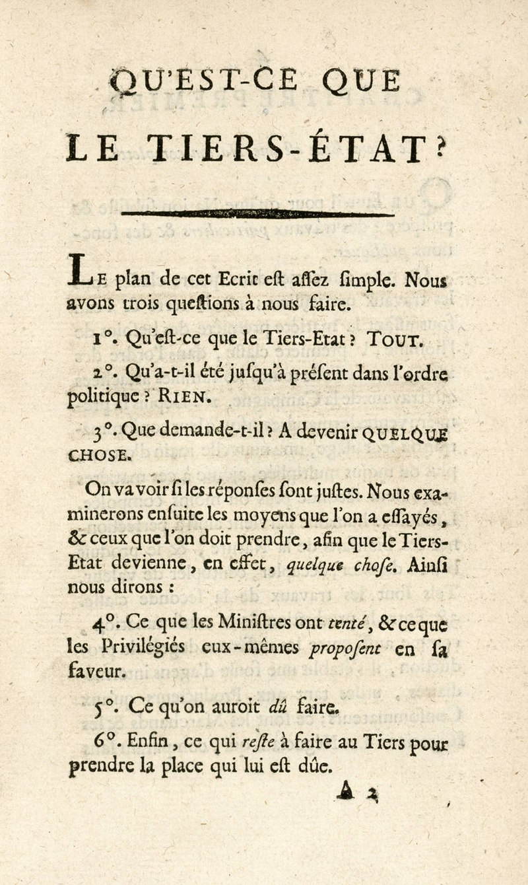
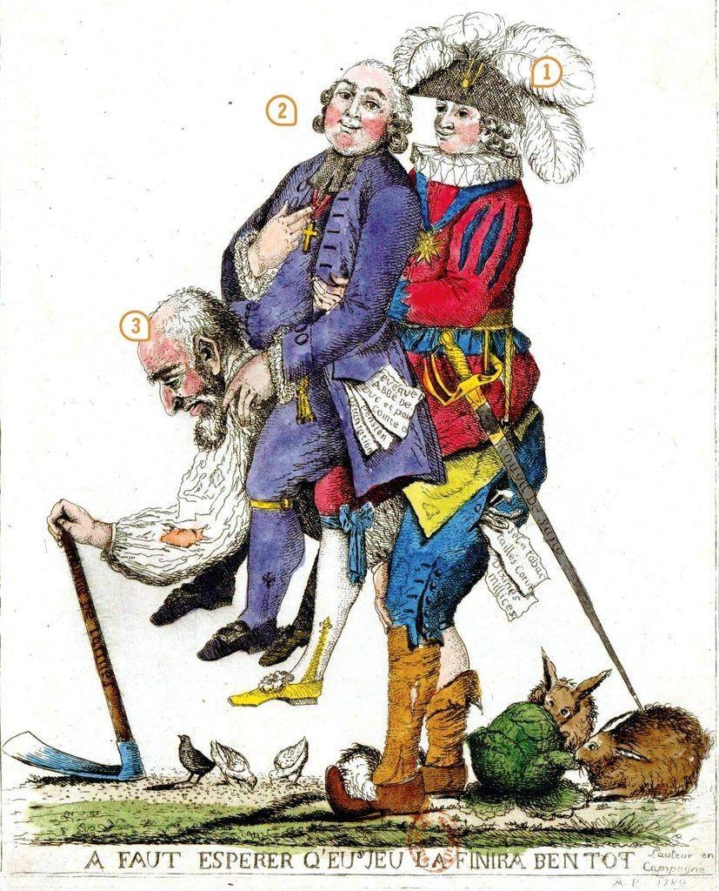
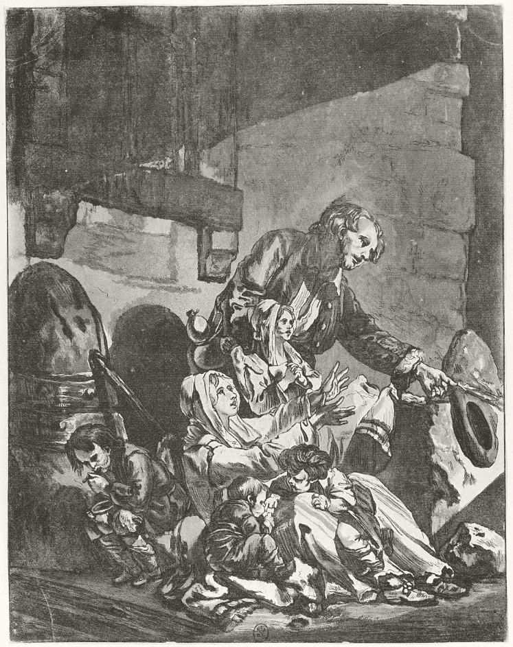

# Nations, empires, nationalités (de 1789 aux lendemains de la Première Guerre mondiale)

# Theme 1: L'Europe face aux révolutions

# La Révolution française et l'Empire: une nouvelle conception de la Nation

## 1. Le déclenchement. Pourquoi la révolution était-elle inévitable?

---

1.1. La France à la veille de la Révolution

- Une monarchie...
- Absolue...
- de Droit divin

---

- Une société d'ordres

## 1.2. Une longue crise de la monarchie

- Les guerres du [xviii]{.smallcaps}^e^ siècle se passent mal
- Coût de la guerre d'Amérique
- Un système fiscal inefficace

## Des réformes attendues mais impossible

- Turgot et la Guerre des farines

---

>17 octobre 1787 : j’ai dîné aujourd’hui avec un groupe de personnes dont la conversation fut entièrement politique (…). Une opinion prévalait, c’est qu’on était à l’aurore d’une grande révolution (…) ; que tout le montre : la grande confusion dans les finances, avec un déficit impossible à combler sans les états généraux du royaume (…).
Sur le trône, un prince animé d’excellentes intentions mais n’ayant pas les ressources d’intelligence suffisantes pour gouverner en un tel moment ; une cour ensevelie dans le plaisir et la dissipation (…).
Une grande agitation dans tous les rangs de la société désireuse de changement sans savoir que chercher ; un grand besoin de liberté croissant depuis la Révolution américaine ; le tout forme une combinaison de circonstances qui annonce une grande fermentation et agitation (…). Tous s’accordent à dire que les états généraux du royaume ne peuvent s’assembler sans qu’une plus grande liberté n’en soit la conséquence.

Arthur Young, *Voyages en France, 1787, 1788, 1789*, 1794
